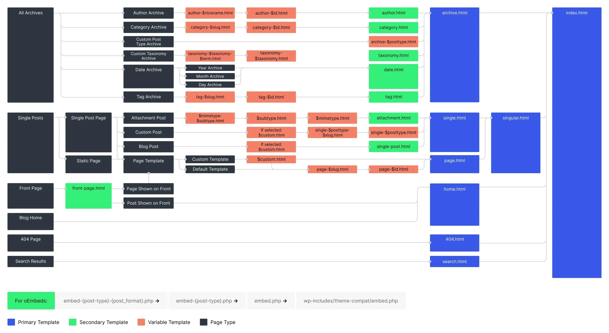

# My Own Theme

## WordPress Theme File Structure



This theme follows the standard WordPress theme file structure. Below is an explanation of the key files and their purposes:

- **front-page.php**: This file is used for the home page of the website. It is the main template for displaying the front page when a static front page is set in WordPress settings.
- **archive.php**: This file is used to display all posts in an archive format. It is typically used for categories, tags, and date-based archives.
- **single.php**: This file is used to display individual blog posts.
- **page.php**: This file is used to display static pages, such as "About Us" or "Contact."
- **header.php**: Contains the header section of the theme, including the navigation menu and site branding.
- **footer.php**: Contains the footer section of the theme.
- **sidebar.php**: Contains the sidebar section of the theme, which may include widgets or additional navigation.
- **functions.php**: This file is used to add custom functionality to the theme, such as registering menus, widgets, and enqueueing styles and scripts.
- **style.css**: The main stylesheet for the theme. It also contains the theme metadata required by WordPress.

## Explanation of Key Templates

- **front-page.php**: This template is specifically used for the home page. If a static front page is set in the WordPress settings, this file will be used to render it.
- **archive.php**: This template is used to display a list of posts, such as blog posts grouped by category, tag, or date.
- **single.php**: This template is used to display a single blog post.
- **page.php**: This template is used to display static pages, such as "About Us" or "Contact."

Feel free to customize these files to suit your needs!

## Custom Blocks

This theme includes custom blocks created using the WordPress Block API. These blocks extend the functionality of the WordPress block editor (Gutenberg) while maintaining compatibility with the classic theme structure.

### Available Custom Blocks

1. **blockone (myblocks/blockone)**: A dynamic block that demonstrates custom block functionality.
2. **blocktwo (myblocks/blocktwo)**: Another custom block with similar structure.

### How Blocks Were Created

The custom blocks were created using the WordPress create-block scaffolding tool. For example, the first block was created using:

```
npx @wordpress/create-block@latest blockone --variant dynamic --target-dir . --namespace myblocks
```

This command:

- Creates a block named "blockone"
- Uses the dynamic block variant (which includes PHP rendering)
- Places files in the current directory
- Uses "myblocks" as the namespace

### Block Structure

Each block follows the modern WordPress block architecture:

- **src/blockname/**: Source files for the block

  - **block.json**: Block configuration and metadata
  - **index.js**: Main entry point for the block editor
  - **edit.js**: React component for the editor view
  - **view.js**: Frontend JavaScript functionality
  - **render.php**: Server-side rendering for dynamic content
  - **editor.scss**: Styles for the editor
  - **style.scss**: Styles for both editor and frontend

- **build/blockname/**: Compiled assets for the block

### Block Registration

Custom blocks are registered in the `functions.php` file using:

```php
function wpdocs_create_blocks_mysite_block_init() {
    register_block_type(__DIR__ . '/build/blockone');
    register_block_type(__DIR__ . '/build/blocktwo');
}
add_action('init', 'wpdocs_create_blocks_mysite_block_init');
```

This makes the blocks available in the WordPress block editor when editing pages or posts.
